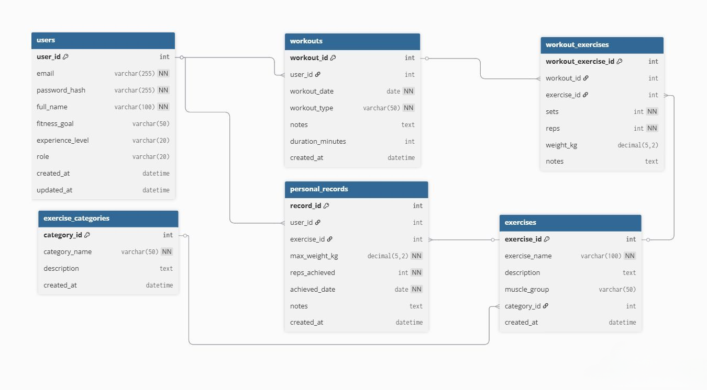

# 5. Fitness-Tracker - Milestone 5: Deployment

## Link for the site :
<h1 align="center" style="font-size: 2.5em; margin: 50px 0;">
  <a href="https://fitness-tracker.yzz.me" style="color: #007bff; text-decoration: none;">
     fitness-tracker.yzz.me
  </a>
 
</h1>
- note if theres a cookie issue caused by the provider (because of some chrome extensions it throws a cookie error) try through incognito or disabling cookies

# FitnessTracker - Milestone 1 Completion

## Milestone 1: Static Frontend Development

### 1. Project Structure (1pt)

Backend Structure
- backend
- routes
- services
- dao
- config

Frontend Structure
Assets
- css
- - style.css
- js
- - custom.js # Application initialization
- - workout.js(to be used later)
- - auth.js (to be used later)
- Views
- - dashboard.html
- - profile.html
- - login.html
- - admin-panel.html
- - register.html
- - exercise-library.html
- - progress-charts.html
- - workout-history.html
- - workout-log
- index.html # Main SPA container

### 2. Static Frontend (3pts)

- **dashboard.html** -> Landing Page
- **progress-charts.html** -> showing progress in in number of sets and weight used
- **exercise-library.html** -> list of exercises sorted by body regions
- **login.html** -> Account login
- **register.html** -> Account Creatiom 
- **profile.html** -> User Account Managment
- **workout-history.html** -> looking back at previous workouts
- **admin-panel.html** -> Admin Control Dashboard
- **index.html** -> Main SPA Container with Footer and Header

### 3. Database Schema (Planning Only) (1pt)

## Milestone 2: Backend Setup and CRUD Operations for Initial Entities

### 1. Database Creation  (1pt)
- sql file containing all tables and test data 
- stored in the main folder with the frontend and backend folders

### 2. DAO Layer (4pts)

- **config.php**
- **BaseDao.php**
- **ExerciseCategoryDao.php**
- **ExerciseDao.php**
- **PersonalRecordDao.php**
- **UserDao.php**
- **WorkoutDao.php**
- **WorkoutExerciseDao.php**
### Milestone 3: Full CRUD Implementation & OpenAPI Documentation
### 1. Business Logic Implementation (2pts) ✅
- Services Layer with Business Logic:

- BaseService.php - Core service functionality
- ExerciseCategoryService.php 
- ExerciseService.php 
- PersonalRecordService.php 
- UserService.php 
- WorkoutExerciseService.php 
- WorkoutService.php 
- testService.php - used for testing if services work

### 2. Presentation Layer (1pt) ✅
- FlightPHP Micro-framework Implementation:

### 3. OpenAPI Documentation (2pts) ✅
- Swagger Integration:

- Swagger

NOTE: Run php -S localhost:8000, In XAMP Turn on (Appache and MySQL)

API Base URL: http://localhost/fitness-tracker/backend/

Swagger Documentation: http://localhost/fitness-tracker/backend/public/v1/docs/

## Milestone 4: Middleware, Authentication, and Authorization

### 1. Authentication and Middleware (1pt) ✅

AuthMiddleware.php - JWT token verification and validation

Roles.php - Roles for users and admin

AuthService.php - Secure authentication (JWT Generation with 24H Validation, Email and Username validation)

Token Reading Issue Fix

### 2. Authentication and Middleware (1pt) ✅

Role Based Access Control

### 3. Frontend Updates (3pts) ✅

## base-service.js

## workout-service.js - Users can create, edit, delete workouts

## workout-log-service.js Users can create, edit, delete comments or posts

## admin-service.js admins can add new exercises, add or delete users 

## personal-records-service.js users can view their personal records

